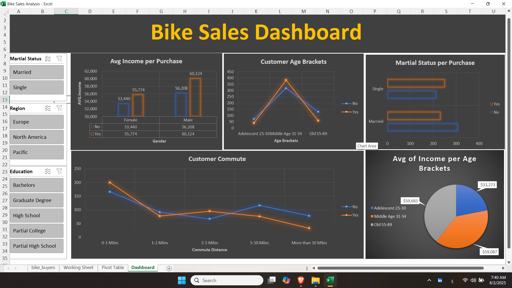
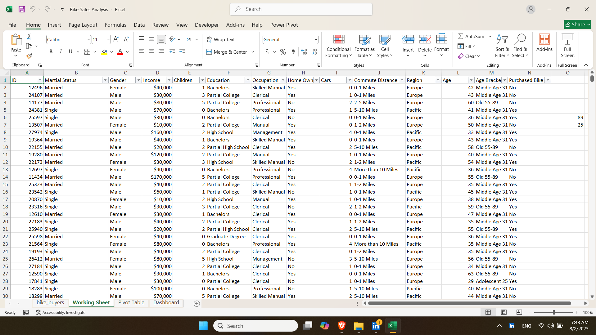

# 🚴‍♂️ Bike Buyers Data Analysis – Excel Dashboard Project

This is an Excel-based data analysis project that explores the demographics and behavior of bike buyers using a structured workflow: from raw data cleaning to visualization through dashboards.

---

## 📂 Project Structure

| Sheet Name       | Description |
|------------------|-------------|
| `bike_buyers`    | Raw dataset containing customer demographics and purchase info |
| `Working Sheet`  | Cleaned and enriched data (with renamed columns, added age brackets, etc.) |
| `Pivot Table`    | Analytical insights generated via pivot tables |
| `Dashboard`      | Visual dashboard summarizing key trends and patterns |

---

## 🎯 Objectives

- Identify factors influencing a customer's decision to purchase a bike.
- Understand how income, age, and education relate to purchasing behavior.
- Segment customers based on age and income for potential targeting.

---

## 🛠 Tools Used

- Microsoft Excel
  - Power Query (for data cleaning & transformation)
  - Pivot Tables (for data analysis)
  - Charts & Slicers (for dashboard visualization)

---

## 📸 Screenshots

### 📈 Dashboard Preview  

### 🧾 Working Sheet  

---

## 📌 KPIs & Key Questions Answered

This section highlights the most important metrics (KPIs) and business questions that were answered using the pivot tables in the project.

---

### 🎯 KPI 1: Average Income by Purchase Decision
- ✅ **Bike Buyers:** ~57,963 average income  
- ❌ **Non-Buyers:** ~54,875 average income  
> Buyers tend to have a higher income than non-buyers.

---

### 👥 KPI 2: Gender-Based Income & Buying Behavior

| Gender | Average Income (Buyers) | Average Income (Non-Buyers) |
|--------|--------------------------|-------------------------------|
| Female | ~55,774                 | ~53,440                       |
| Male   | ~60,124                 | ~56,208                       |

> ✅ Both genders show higher income among buyers. Males are more likely to buy bikes overall.

---

### 🎂 KPI 3: Most Engaged Age Group
- ✅ **Middle Age (31–54)** customers are the most frequent bike buyers.  
> This age group represents the core of the target audience.

---

### 🎓 KPI 4: Education Level Impact
- ✅ Customers with a **Bachelor’s degree** are more likely to purchase bikes than others.  
> Educational background shows a clear trend in purchasing behavior.

---

### 🚗 KPI 5: Car Ownership Correlation
- Surprisingly, many bike buyers also **own one or more cars**.  
> Indicates usage beyond necessity — possibly for health, environment, or lifestyle.

---

## ✅ How to Explore

1. Open the Excel file.
2. Start with the **Working Sheet** to understand how the data was prepared.
3. Check the **Pivot Table** sheet for analytical breakdowns.
4. Use the **Dashboard** to interactively explore trends.

---

## 📬 Contact

For feedback or questions, feel free to reach out via [LinkedIn]([www.linkedin.com/in/abd-alrahman-elshafei-154686272](https://www.linkedin.com/in/abd-alrahman-elshafei-154686272/)).

---

