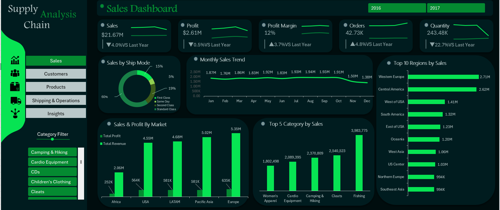
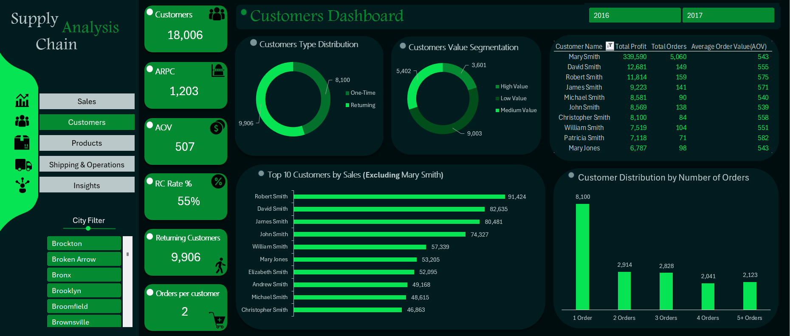
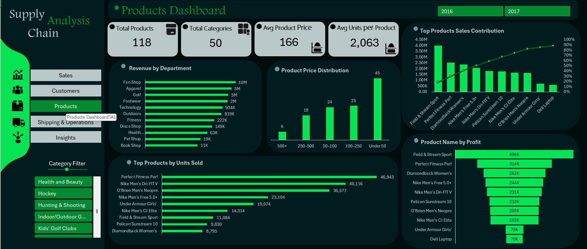
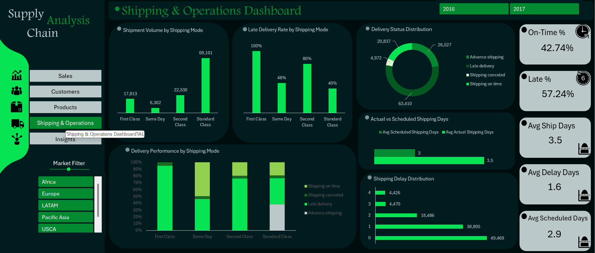
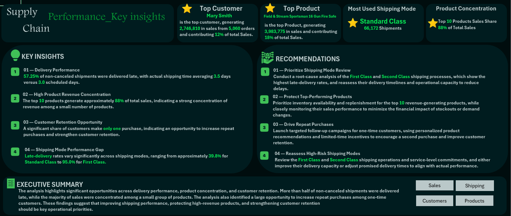

# Supply Chain Analysis | Excel Dashboard Project

An interactive, five-dashboard **Microsoft Excel** project that analyzes sales, customers, products, and shipping performance for a supply chain business, and turns the findings into clear insights and recommendations.

---

## Table of Contents

1. [Project Overview](#1-project-overview)
2. [Data Preparation & Modeling](#2-data-preparation--modeling)
3. [Dashboards](#3-dashboards)
   - [Sales Dashboard](#sales-dashboard)
   - [Customer Dashboard](#customer-dashboard)
   - [Product Dashboard](#product-dashboard)
   - [Shipping & Operations Dashboard](#shipping--operations-dashboard)
   - [Final Insights Dashboard](#final-insights-dashboard)
4. [Customer Outlier](#4-customer-outlier)
5. [Product Concentration](#5-product-concentration)
6. [Final Insights Dashboard: Detailed Content](#6-final-insights-dashboard-detailed-content)
7. [Key Insights](#7-key-insights)
8. [Business Recommendations](#8-business-recommendations)
9. [Tools & Techniques](#9-tools--techniques)
10. [Project Structure](#10-project-structure)
11. [Author](#11-author)

---

## 1. Project Overview

### Purpose
This project analyzes supply chain data across four business areas: **Sales**, **Customers**, **Products**, and **Shipping & Operations**. The results are brought together in a **Final Insights** dashboard that presents key findings, recommendations, and an executive summary.

### Business Problem
The analysis focuses on three areas that the project identifies as the main opportunities:

- **Delivery performance:** more than half of non-canceled shipments were delivered late.
- **Product concentration:** a small group of products generates most of the revenue (the Top 10 products account for ~88% of total sales).
- **Customer retention:** a significant share of customers make only one purchase.

### Built With
The entire project was built in **Microsoft Excel**, using an interactive dashboard design with slicers and sidebar navigation between dashboards.

### Project at a Glance

| Item | Detail |
|---|---|
| Dashboards | 5 (Sales, Customers, Products, Shipping & Operations, Final Insights) |
| Slicers / filters | Year (2016, 2017), City, Category, Market |
| Headline KPIs | Sales $21.67M · Profit $2.61M · Profit Margin 12% · Orders 42.73K · Quantity 243.48K |
| Customers / Products analyzed | 18,006 customers · 118 products across 50 categories |

---

## 2. Data Preparation & Modeling

The original dataset contained **53 columns**. The dashboards draw on a focused subset of these fields, organized around five analytical dimensions:

| Dimension | Fields analyzed | Where it is used |
|---|---|---|
| **Time** | Year (2016, 2017), Month | Year slicer on the Sales, Customers, Products and Shipping dashboards; Monthly Sales Trend |
| **Geography** | City, Market, Region | City Filter (Customers); Market Filter (Shipping); Sales & Profit by Market; Top 10 Regions by Sales |
| **Product** | Category, Department, Product name, Price band | Category Filter (Sales, Products); Revenue by Department; Product Price Distribution; Top Products charts |
| **Customer** | Customer name, Customer type (One-Time / Returning), Value segment, Number of orders | Customer KPIs, segmentation donuts, Top 10 Customers, order-count distribution |
| **Shipping** | Shipping mode, Delivery status, Scheduled vs. actual shipping days, Delay days | All Shipping & Operations visuals and the Ship Mode donut on the Sales dashboard |

<!--
TO COMPLETE (requires the workbook): describe the fact / dimension table structure here
(Fact_Sales, Dim_Location, Calendar and any other dimension tables), which columns were kept
from the 53 original columns, the cleaning steps applied, and why the data was split into
fact and dimension tables. Only add what is confirmed in the workbook.
-->

---

## 3. Dashboards

All dashboards share the same layout: a sidebar with navigation buttons (**Sales, Customers, Products, Shipping & Operations, Insights**), a set of KPI cards or highlights, and a set of charts. The **Year** slicer (2016, 2017) appears on the Sales, Customers, Products and Shipping & Operations dashboards.

---

### Sales Dashboard

#### Purpose
Tracks overall commercial performance (sales, profit, margin, orders and quantity, each compared with last year) and shows where sales come from by ship mode, month, market, category and region.

#### KPIs

| KPI | Value | Change vs. Last Year |
|---|---|---|
| Sales | $21.67M | ▼ 4.0% |
| Profit | $2.61M | ▼ 0.5% |
| Profit Margin | 12% | ▲ 3.7% |
| Orders | 42.73K | ▲ 4.8% |
| Quantity | 243.48K | ▼ 22.7% |

Each KPI card also includes a small trend line.

#### Visual Analysis

| Visual | Chart Type | What It Shows |
|---|---|---|
| **Sales by Ship Mode** | Donut | Share of sales across First Class, Same Day, Second Class and Standard Class (slices of 60%, 19%, 15% and 5%) |
| **Monthly Sales Trend** | Line chart | Monthly sales from January to December: steady at 1.76M–1.94M from January to October, then 1.50M in November and 1.38M in December |
| **Top 10 Regions by Sales** | Horizontal bar | Western Europe 2.71M, Central America 2.62M, West of USA 1.41M, South America 1.32M, East of USA 1.23M, Oceania 1.20M, West Asia 1.06M, US Center 1.03M, Northern Europe 994K, Southeast Asia 994K |
| **Sales & Profit By Market** | Clustered column | Total Revenue vs. Total Profit by market (see table below) |
| **Top 5 Category by Sales** | Column | Fishing 3,983,775 · Cleats 2,540,523 · Camping & Hiking 2,370,809 · Cardio Equipment 2,089,395 · Women's Apparel 1,802,498 |

**Sales & Profit By Market**

| Market | Total Revenue | Total Profit |
|---|---|---|
| Europe | 5.35M | 635K |
| Pacific Asia | 5.02M | 581K |
| LATAM | 4.68M | 581K |
| USA | 4.55M | 564K |
| Africa | 2.06M | 252K |

#### Filters
- **Year** slicer (2016, 2017)
- **Category Filter** slicer (scrollable list, e.g., Camping & Hiking, Cardio Equipment, CDs, Children's Clothing, Cleats)

#### Key Insights
- **Profit held up while sales fell.** Sales declined 4.0% and profit only 0.5%, so profit margin improved by 3.7% versus last year.
- **More orders, fewer units.** Orders grew 4.8% while quantity dropped 22.7%, meaning fewer units per order.
- **Sales were stable for most of the year.** Monthly sales stayed between 1.76M and 1.94M from January to October, followed by lower values in November (1.50M) and December (1.38M).
- **Markets differ by scale, not by margin.** Calculated from the chart values, profit is roughly 12% of revenue in every market. Europe is the largest market (5.35M revenue, 635K profit) and Africa the smallest (2.06M revenue, 252K profit).
- **Two regions lead clearly.** Western Europe (2.71M) and Central America (2.62M) are almost double the next region, West of USA (1.41M).
- **Fishing is the top category** at 3,983,775. This equals the sales of the Top Product shown on the Final Insights dashboard, consistent with that single product driving the category's ranking.



---

### Customer Dashboard

#### Purpose
Analyzes customer behavior: how many customers there are, how many return, how they are segmented by value, how many orders they place, and who the highest-value customers are.

#### KPIs

| KPI | Value |
|---|---|
| Customers | 18,006 |
| ARPC | 1,203 |
| AOV | 507 |
| RC Rate % | 55% |
| Returning Customers | 9,906 |
| Orders per customer | 2 |

*The KPIs reconcile with the Sales dashboard totals: 1,203 ≈ $21.67M ÷ 18,006 customers, and 507 ≈ $21.67M ÷ 42.73K orders. The 55% RC Rate equals 9,906 returning ÷ 18,006 customers.*

#### Visual Analysis

| Visual | Chart Type | What It Shows |
|---|---|---|
| **Customers Type Distribution** | Donut | One-Time customers (8,100) vs. Returning customers (9,906) |
| **Customers Value Segmentation** | Donut | Customers split into High Value, Medium Value and Low Value segments (5,402, 3,601 and 9,003 customers, totaling 18,006) |
| **Top 10 Customers by Sales (Excluding Mary Smith)** | Horizontal bar | Robert Smith 91,424 · David Smith 82,635 · James Smith 80,481 · John Smith 74,327 · William Smith 57,339 · Mary Jones 53,205 · Elizabeth Smith 52,095 · Andrew Smith 49,168 · Michael Smith 48,615 · Christopher Smith 46,863 |
| **Customer table** | Table | Customer Name, Total Profit, Total Orders and Average Order Value (AOV) for ten customers (see below) |
| **Customer Distribution by Number of Orders** | Column | 1 Order: 8,100 · 2 Orders: 2,914 · 3 Orders: 2,828 · 4 Orders: 2,041 · 5+ Orders: 2,123 |

**Customer table**

| Customer Name | Total Profit | Total Orders | AOV |
|---|---|---|---|
| Mary Smith | 339,590 | 5,060 | 543 |
| David Smith | 12,681 | 149 | 555 |
| Robert Smith | 11,814 | 159 | 575 |
| James Smith | 9,223 | 141 | 571 |
| Michael Smith | 8,581 | 90 | 540 |
| John Smith | 8,569 | 138 | 539 |
| Christopher Smith | 8,100 | 84 | 558 |
| William Smith | 7,519 | 104 | 551 |
| Patricia Smith | 7,118 | 71 | 582 |
| Mary Jones | 6,787 | 98 | 543 |

#### Filters
- **Year** slicer (2016, 2017)
- **City Filter** slicer (scrollable list, e.g., Brockton, Broken Arrow, Bronx, Brooklyn, Broomfield, Brownsville)

#### Key Insights
- **Retention is the main opportunity.** 8,100 of 18,006 customers (45%) bought only once, and customers with a single order form the largest group in the order distribution (8,100, versus 2,914 for the next group).
- **A returning base already exists.** 9,906 customers (55%) are returning customers, and the average customer places 2 orders.
- **One customer stands out.** Mary Smith's figures are far above every other customer and were handled separately (see [Customer Outlier](#4-customer-outlier)).
- **Excluding that outlier, the Top 10 customers sit in a narrow range**, from 91,424 down to 46,863 in sales.



---

### Product Dashboard

#### Purpose
Analyzes the product portfolio: catalog size, pricing, department revenue, and which products drive sales, units and profit.

#### KPIs

| KPI | Value |
|---|---|
| Total Products | 118 |
| Total Categories | 50 |
| Avg Product Price | 166 |
| Avg Units per Product | 2,063 |

#### Visual Analysis

| Visual | Chart Type | What It Shows |
|---|---|---|
| **Revenue by Department** | Horizontal bar | Fan Shop 10M · Apparel 5M · Golf 3M · Footwear 2M · Technology 934K · Outdoors 819K · Fitness 222K · Discs Shop 149K · Health… 63K · Pet Shop 19K · Book Shop 11K |
| **Product Price Distribution** | Column | Number of products per price band: Under 50: 45 · 100–250: 25 · 50–100: 24 · 250–500: 18 · 500+: 6 (totaling 118 products) |
| **Top Products Sales Contribution** | **Combo chart** (columns + line) | Sales of the top 10 products as columns (primary axis) with a percentage line on the secondary axis (0–100%). See [Product Concentration](#5-product-concentration) |
| **Top Products by Units Sold** | Horizontal bar | Perfect Fitness Perf 46,943 · Nike Men's Dri-FIT V 40,116 · O'Brien Men's Neopre 36,577 · Nike Men's Free 5.0+ 23,104 · Under Armour Girls' 19,974 · Nike Men's CJ Elite 14,314 · Field & Stream Sport 11,084 · Pelican Sunstream 10 9,830 · Diamondback Women's 8,795 |
| **Product Name by Profit** | Centered horizontal bar (funnel style) | Field & Stream Sport 496K · Perfect Fitness Perf 314K · Diamondback Women's 262K · Nike Men's Free 5.0+ 244K · Nike Men's Dri-FIT V 231K · Pelican Sunstream 10 210K · O'Brien Men's Neopre 205K · Nike Men's CJ Elite 203K · Under Armour Girls' 75K · Dell Laptop 70K |

#### Filters
- **Year** slicer (2016, 2017)
- **Category Filter** slicer (scrollable list, e.g., Health and Beauty, Hockey, Hunting & Shooting, Indoor/Outdoor G…, Kids' Golf Clubs)

#### Key Insights
- **Revenue is concentrated in a few products.** The Top 10 products generate ~88% of total sales.
- **Sales volume and profit do not rank the same way.** Perfect Fitness Perf sells the most units (46,943), but Field & Stream Sport leads profit (496K) with only 11,084 units. Nike Men's Dri-FIT V is second in units (40,116) but fifth in profit (231K).
- **Some high-volume products earn little profit.** Under Armour Girls' sold 19,974 units (5th of the 9 products shown) yet earned 75K, versus 203K or more for each of the eight products ranked above it.
- **The catalog leans toward lower price points.** 45 of the 118 products (38%) are priced under 50, and only 6 are priced above 500.
- **Fan Shop is the largest department** at 10M, twice the next department (Apparel, 5M).



---

### Shipping & Operations Dashboard

#### Purpose
Evaluates delivery reliability: shipment volume, late-delivery rates, delivery status, and the gap between scheduled and actual shipping days, by shipping mode.

#### KPIs

| KPI | Value |
|---|---|
| On-Time % | 42.74% |
| Late % | 57.24% |
| Avg Ship Days | 3.5 |
| Avg Delay Days | 1.6 |
| Avg Scheduled Days | 2.9 |

<!-- VERIFY: Avg Scheduled Days shows 2.9 here, the Actual vs Scheduled chart labels it 3, and the Final Insights dashboard says 3.0. Late % is 57.24% here but 57.25% on Final Insights. Align these values before publishing. -->

#### Visual Analysis

| Visual | Chart Type | What It Shows |
|---|---|---|
| **Shipment Volume by Shipping Mode** | Column | First Class 17,813 · Same Day 6,302 · Second Class 22,530 · Standard Class 69,101 |
| **Late Delivery Rate by Shipping Mode** | Column | First Class 100% · Same Day 48% · Second Class 80% · Standard Class 40% |
| **Delivery Status Distribution** | Donut | Shipments split across four statuses (Advance shipping, Late delivery, Shipping canceled, Shipping on time); the slice values are 20,837, 26,527, 4,972 and 63,410, totaling 115,746 shipments |
| **Delivery Performance by Shipping Mode** | 100% stacked column | The mix of Shipping on time, Shipping canceled, Late delivery and Advance shipping within each mode |
| **Actual vs Scheduled Shipping Days** | Bar | Avg Scheduled Shipping Days (3) vs. Avg Actual Shipping Days (3.5) |
| **Shipping Delay Distribution** | Horizontal bar | Shipments by delay value: 0 → 49,469 · 1 → 38,895 · 2 → 18,486 · 3 → 4,470 · 4 → 4,426 |

<!-- VERIFY: The Late Delivery Rate chart shows First Class at 100%, but the Final Insights dashboard states 95.0% for First Class. Standard Class is 40% here and 39.8% there (consistent after rounding). Confirm the denominator (all shipments vs. non-canceled) and label it consistently. -->

#### Filters
- **Year** slicer (2016, 2017)
- **Market Filter** slicer (scrollable list: Africa, Europe, LATAM, Pacific Asia, USCA)

#### Key Insights
- **Late delivery is the dominant issue.** The Late % is 57.24%, and shipments take 3.5 days on average versus 3 days scheduled.
- **Performance varies widely by shipping mode.** Late-delivery rates range from 40% (Standard Class) to 80% (Second Class) and 100% (First Class), with Same Day at 48%.
- **The most-used mode is also the best-performing one.** Standard Class carries by far the most shipments (69,101 of 115,746) and has the lowest late-delivery rate. It is also the only mode with a visible Advance shipping segment in the Delivery Performance chart.
- **Most delays are short.** Shipments with a delay of 1 day (38,895) and 2 days (18,486) outnumber those with 3 days (4,470) or 4 days (4,426).



---

### Final Insights Dashboard

#### Purpose
Consolidates the analysis into one executive view: headline highlights, key insights, recommendations and an executive summary. Full content is documented in [Section 6](#6-final-insights-dashboard-detailed-content).

#### KPIs (Highlight Cards)

| Card | Value |
|---|---|
| **Top Customer** | Mary Smith: 2,746,810 in sales from 5,060 orders, 12% of total sales |
| **Top Product** | Field & Stream Sportsman 16 Gun Fire Safe: 3,983,775 in sales, 18% of total sales |
| **Most Used Shipping Mode** | Standard Class: 66,172 shipments |
| **Product Concentration** | Top 10 products account for 88% of total sales |

<!-- VERIFY: Standard Class is 66,172 shipments here but 69,101 on the Shipping & Operations dashboard (difference: 2,929). If this card excludes canceled shipments, say so on the dashboard. Also, 2,746,810 of the 21.67M total is ~12.7%, but the card shows 12%. -->

#### Visual Analysis
A text-based dashboard organized into four highlight cards, a **Key Insights** panel (4 items), a **Recommendations** panel (4 items), and an **Executive Summary** with navigation buttons back to the Sales, Shipping, Customers and Products dashboards.

#### Filters
No slicers. Navigation buttons: Sales, Shipping, Customers, Products.

#### Key Insights
The four insights cover delivery performance, product revenue concentration, customer retention and the shipping-mode performance gap. Each is detailed in [Section 6](#6-final-insights-dashboard-detailed-content).



---

## 4. Customer Outlier

**The customer:** Mary Smith.

### Why she was treated as an outlier
Her figures are far larger than any other customer's:

| Metric | Mary Smith | Other customers |
|---|---|---|
| Sales | 2,746,810 (12% of total sales) | 91,424 for the next-highest customer in the comparison chart (Robert Smith), so roughly **30×** higher |
| Total Orders | 5,060 | 71–159 for the other nine customers in the customer table |
| Total Profit | 339,590 | 6,787–12,681 for the other nine customers in the customer table |

Keeping her in a customer-by-customer comparison would dominate the chart scale and make the rest of the customers hard to compare.

### How it was handled
- **Excluded from the main comparison.** The bar chart is explicitly titled **"Top 10 Customers by Sales (Excluding Mary Smith)"**, so the other customers can be compared on a readable scale.
- **The underlying data was preserved.** She still appears in the Customer table (Total Profit 339,590, Total Orders 5,060, AOV 543), and the overall KPIs still reconcile with the full sales total (for example, ARPC 1,203 ≈ $21.67M ÷ 18,006 customers), indicating that she was not removed from the data.
- **Presented separately in the Final Insights Dashboard.** She is featured in the **Top Customer** card: 2,746,810 in sales from 5,060 orders, contributing 12% of total sales.

---

## 5. Product Concentration

### Finding
The Product dashboard and the Final Insights dashboard both show that the **Top 10 products generate ~88% of total sales**. The Final Insights dashboard presents this as a **Product Concentration** card ("Top 10 Products Sales Share: 88% of Total Sales") and as Key Insight 02. With 118 products in total (Product dashboard), the Top 10 represent roughly 8% of the catalog.

The single top product (Field & Stream Sportsman 16 Gun Fire Safe) contributes 3,983,775 in sales, or 18% of total sales.

### Chart used
The **Top Products Sales Contribution** chart on the Product dashboard is a **Combo Chart**:
- **Columns** show the sales of each of the top 10 products, in descending order (primary axis, 0 to 4.5M).
- A **line** on the secondary axis (0% to 100%) rises across the ten products and ends near the 88% mark, reading as the cumulative share of total sales.

The combo format lets the viewer see two things at once: how large each product is (columns) and how quickly the total builds up (line). The steep rise of the line across the first few products, followed by a flattening curve, shows the concentration visually.

### Business meaning
Revenue depends heavily on a small group of products, so stockouts or demand changes in those products would have an outsized effect on total sales. This is why the project recommends prioritizing inventory availability and replenishment for the Top 10 products (see [Business Recommendations](#8-business-recommendations)).

---

## 6. Final Insights Dashboard: Detailed Content

### Highlight Cards
- **Top Customer:** Mary Smith (2,746,810 in sales, 5,060 orders, 12% of total sales)
- **Top Product:** Field & Stream Sportsman 16 Gun Fire Safe (3,983,775 in sales, 18% of total sales)
- **Most Used Shipping Mode:** Standard Class (66,172 shipments)
- **Product Concentration:** Top 10 products = 88% of total sales

### Key Insights Panel

| # | Insight | Finding |
|---|---|---|
| 01 | **Delivery Performance** | 57.25% of non-canceled shipments were delivered late; actual shipping time averaged 3.5 days versus 3.0 scheduled days |
| 02 | **High Product Revenue Concentration** | The top 10 products generate approximately 88% of total sales |
| 03 | **Customer Retention Opportunity** | A significant share of customers make only one purchase, indicating room to increase repeat purchases |
| 04 | **Shipping Mode Performance Gap** | Late-delivery rates range from approximately 39.8% (Standard Class) to 95.0% (First Class) |

### Recommendations Panel

| # | Recommendation | Action |
|---|---|---|
| 01 | **Prioritize Shipping Mode Review** | Run a root-cause analysis of First Class and Second Class shipping (the highest late-delivery rates) and reassess delivery timelines and operational capacity |
| 02 | **Protect Top-Performing Products** | Prioritize inventory availability and replenishment for the top 10 revenue-generating products, and monitor their sales closely |
| 03 | **Drive Repeat Purchases** | Launch targeted follow-up campaigns for one-time customers, with personalized product recommendations and limited-time incentives |
| 04 | **Reassess High-Risk Shipping Modes** | Review First Class and Second Class operations and service-level commitments; either improve delivery capacity or adjust promised delivery times |

### Executive Summary
The dashboard's executive summary states that the analysis highlights significant opportunities in delivery performance, product concentration and customer retention: more than half of non-canceled shipments were delivered late, most sales come from a small group of products, and there is a large opportunity to increase repeat purchases among one-time customers. It concludes that improving shipping performance, protecting high-revenue products and strengthening customer retention should be key operational priorities.

---

## 7. Key Insights

1. **Late delivery is a systemic problem, and it is uneven across modes.** 57.24% of shipments are late and actual shipping time (3.5 days) exceeds the scheduled time (3 days). The gap between modes is large: First Class and Second Class have the highest late-delivery rates, while Standard Class, the most-used mode, has the lowest (~40%).
2. **Revenue is concentrated in very few products.** About 8% of the catalog (10 of 118 products) generates ~88% of sales, and one product alone accounts for 18%.
3. **Sales volume is not the same as value.** The best-selling product by units (Perfect Fitness Perf, 46,943 units) is not the most profitable (Field & Stream Sport, 496K profit from 11,084 units), and some high-volume products (e.g., Under Armour Girls') earn much less profit than their volume suggests.
4. **Retention is the largest customer opportunity.** 45% of customers (8,100 of 18,006) bought only once, and single-order customers are the largest group in the order distribution.
5. **A single customer record distorts customer comparisons.** Mary Smith's sales are roughly 30× those of the next-highest customer, so she was excluded from the Top 10 comparison but kept in the data and highlighted separately.
6. **Profitability improved even as sales declined.** Sales fell 4.0% and profit 0.5%, so the profit margin rose 3.7% versus last year. Orders grew 4.8% while quantity fell 22.7%.
7. **Markets differ in scale, not in margin.** Profit is roughly 12% of revenue in every market; Europe is the largest (5.35M revenue) and Africa the smallest (2.06M).

---

## 8. Business Recommendations

Recommendations are based only on the findings above. The first four are those presented on the Final Insights dashboard; the fifth is supported by the Product dashboard.

1. **Review First Class and Second Class shipping operations.** These modes show the highest late-delivery rates. Conduct a root-cause analysis, then either improve delivery capacity or adjust the delivery timelines promised to customers.
2. **Protect the Top 10 products.** With ~88% of sales concentrated in 10 products, prioritize their inventory availability and replenishment and monitor their sales performance to limit the financial impact of stockouts or demand changes.
3. **Launch repeat-purchase campaigns for one-time customers.** 8,100 customers bought only once. Use personalized product recommendations and limited-time incentives to encourage a second purchase.
4. **Use Standard Class as the performance benchmark.** It handles the most shipments and has the lowest late-delivery rate, so its processes are a reference point for improving the other modes.
5. **Review pricing and cost for high-volume, low-profit products.** For example, Under Armour Girls' ranks fifth in units sold but earns 75K profit, far below the products ranked above it in profit.

---

## 9. Tools & Techniques

| Tool / Technique | Evidence in the project |
|---|---|
| **Microsoft Excel** | Entire project built in Excel |
| **Slicers** | Year, City Filter, Category Filter and Market Filter |
| **Excel charts** | Donut, column, clustered column, 100% stacked column, line, horizontal bar and centered (funnel-style) bar charts |
| **Combo Chart** | Top Products Sales Contribution (columns + percentage line on a secondary axis) |
| **KPI cards & trend lines** | KPI cards on the Sales, Customer, Product and Shipping dashboards; year-over-year change indicators on the Sales dashboard |
| **KPI Analysis** | Sales, profit margin, ARPC, AOV, retention rate, on-time / late rate, shipping days |
| **Concentration analysis** | Top 10 products share of total sales (~88%) |
| **Customer segmentation** | One-Time vs. Returning customers; High / Medium / Low value segments |
| **Outlier handling** | Mary Smith excluded from the Top 10 customer comparison and shown separately |
| **Dashboard design & navigation** | Multi-dashboard layout with sidebar buttons linking the dashboards |

<!--
TO COMPLETE (requires the workbook): add Power Query, Excel Data Model, PivotTables / PivotCharts,
Data Cleaning and Data Modeling only if confirmed in the workbook.
-->

---

## 10. Project Structure

```
.
├── README.md
├── <your-workbook-filename>.xlsx
└── screenshots/
    ├── sales_dashboard.png
    ├── customer_dashboard.png
    ├── product_dashboard.png
    ├── shipping_operations_dashboard.png
    └── final_insights.png
```

---

## 11. Author

**Abdalrahman Elshafei**

Data Analyst | Excel | SQL | Power BI
